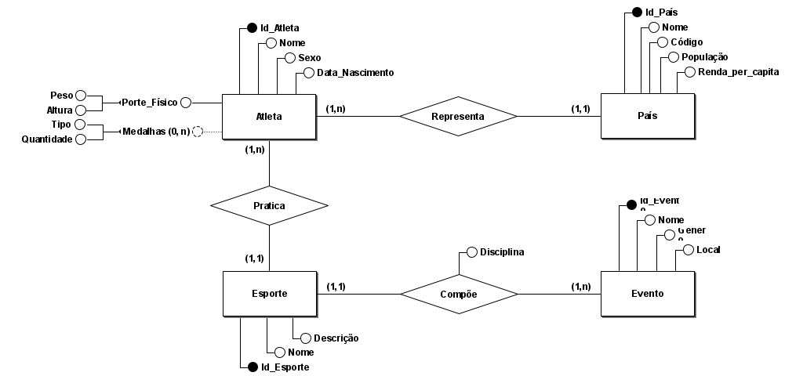

<h1>Trabalho de Banco de Dados</h1>
<h2>UFRJ - 2019.2</h2>

Este repositório é uma aplicação Web para apresentar o conteúdo do banco de dados escolhido ao usuário de maneira agradável.

O tema escolhido foi: "Olimpíadas Rio 2016".

Link para o banco de dados original:
    <a href="https://www.kaggle.com/rio2016/olympic-games#athletes.csvKaggle">
https://www.kaggle.com/rio2016/olympic-games#athletes.csvKaggle
    </a>

<h3>Modelagem ER:</h3>

<h3>Códigos no terminal</h3>
<ol>
    <li>
        git clone https://github.com/RafaelxFernandes/Trabalho-BD.git
    </li>
    <li>
        cd TrabalhoBD
    </li>
    <li>
        npm install
    </li>
</ol>

<h3>Prototipagem do projeto</h3>
<ol>
    <li>
        Figma: https://www.figma.com/file/OtkRl0awQRJIonyIUhFnjy/Trabalho-BD?node-id=0%3A1
    </li>
</ol>
